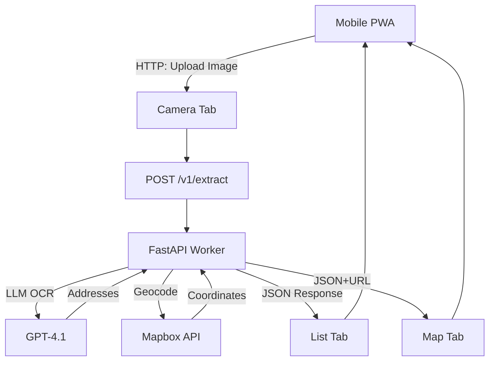

## Summary

This Software Requirements Specification (SRS) outlines the planning and requirements for **Address Mapper**, a privacy-focused, no-login mobile-first Progressive Web App that enables users to upload images of paper lists, extract street addresses via OCR powered by GPT-4.1, geocode them to latitude/longitude, and visualize the results as pins on an interactive map. The front end will be a Vite-React-TypeScript PWA styled with Shadcn UI and Tailwind CSS, managed with pnpm and Biome, and deployed to Cloudflare Pages; the back end will be a FastAPI service written in Python, managed via UV, and running on Cloudflare Workers. The project will use a monorepo structure with separate `ui/` and `api/` folders, and a root-level Docker Compose setup. Configuration will rely on `.env` and `.env.example` files committed to the repo. This document covers objectives, scope, technical stack, architecture, functional requirements, UI flow, API endpoints (versioned), project structure, privacy considerations, data and user flows, and deployment.

---

## 1. Introduction

The purpose of this SRS is to provide a single source of truth for all stakeholders—product managers, designers, and developers—defining what Address Mapper will do and how it will perform. A clear SRS helps avoid misunderstandings and rework by specifying functional, interface, and versioning requirements in detail.

---

## 2. Objectives

1. **Automated Address Extraction**  
   Leverage OCR through the GPT-4.1 model to accurately extract postal addresses from user-uploaded images, reducing manual entry errors and speeding up data capture.

2. **Geocoding & Mapping**  
   Convert extracted addresses into GPS coordinates and display them as pins on an interactive map, enabling route planning or visualization of stops.

3. **Shareable, Privacy-Preserving Links**  
   Generate permalinks containing a Base64-encoded hash of results in the URL, so users can bookmark and share without requiring an account.  
   Also provide a “Share Map” feature that encodes the address data tightly into URL query parameters for easy map sharing.

4. **Immediate Feedback**  
   Provide real-time updates as images are uploaded, with extracted addresses displayed alongside their corresponding map pins.

5. **Local History**  
   Store a history of lookups in localStorage so users can revisit past extractions without re-uploading images.

---

## 3. Scope

### In Scope

- **Front-end**: Mobile-first SPA built with Vite, React, and TypeScript; styled using Shadcn UI and Tailwind CSS; PWA support via vite-plugin-pwa; linting with Biome; package management with pnpm; client-side query history via localStorage; bottom navigation with three tabs (Camera, List, Map); “Share Map” URL encoding.
- **Back-end**: Python FastAPI application managed by UV; deployed on Cloudflare Workers (ASGI).
- **Monorepo Structure**: Root folder containing `ui/` for front-end code and `api/` for back-end code, with a shared root-level `compose.yaml` to build and run both services together.
- **Configuration**: Use `.env` for local environment variables (excluded from VCS) and commit a `.env.example` template to the repository.
- **OCR & LLM Integration**: OpenAI GPT-4.1 for OCR and extraction.
- **Mapping**: Mapbox GL JS for rendering pins.
- **No Authentication**: Anonymous usage with ephemeral image storage and persistent address storage only in URL or localStorage.

### Out of Scope

- User accounts and login.
- Collaborative multi-user editing.
- Full offline mode beyond service worker caching.

---

## 4. Technical Stack

### 4.1 Front-end

- **pnpm**: Fast JS/TS package manager.
- **Vite**: Modern build tool.
- **vite-plugin-pwa**: Adds PWA features (installability, caching).
- **React & TypeScript**: UI framework.
- **Shadcn UI + Tailwind CSS**: Component library and styling.
- **Biome**: Linter/formatter.
- **Mapbox GL JS**: Interactive mapping.
- **LocalStorage**: Persist query history.

### 4.2 Back-end

- **Python FastAPI**: ASGI framework.
- **UV**: Python dependency manager.
- **Cloudflare Workers**: Edge deployment.
- **OpenAI GPT-4.1 API**: OCR engine.
- **Mapbox Geocoding API**: Address to lat/long.

---

## 5. Architecture



- **Three Tabs (Floating Island Nav)**: Camera, List, Map.
- **Mobile-Only**: Optimized for handset form-factor.
- **Immediate Upload**: Each capture triggers `POST /v1/extract` and shows loading indicator.
- **Extraction Indicator**: Thumbnail and checkmark once extraction completes.

---

## 6. Functional Requirements

| ID  | Requirement                                                                                                 |
| --- | ----------------------------------------------------------------------------------------------------------- |
| FR1 | **Camera Tab**: User taps camera icon, captures or selects image, auto-uploads to `POST /v1/extract`.      |
| FR2 | **Extraction**: Back end processes image with GPT-4.1 OCR, returns structured addresses + thumbnail.        |
| FR3 | **List Tab**: Displays scrollable list of extracted addresses; each entry shows thumbnail of source image.  |
| FR4 | **List Actions**: User can delete an entry. (Edit/resend reserved for future.)                              |
| FR5 | **Map Tab**: Renders pins on Mapbox map from current list data.                                            |
| FR6 | **History**: All extractions saved in localStorage; user can revisit past sessions.                         |
| FR7 | **Share Map**: User taps share icon to generate URL with encoded query params containing addresses/coords. |
| FR8 | **New Extraction**: User clears session via clear button, resets localStorage and UI.                     |

---

## 7. API Endpoints (Versioned)

All endpoints are prefixed with `/v1` to allow for future versioning and backward compatibility.

### 7.1 POST /v1/extract
- **Description**: Uploads image, performs OCR and geocoding.
- **Request**:
  - Headers: `Content-Type: multipart/form-data`
  - Body: `file`: image/jpeg or image/png
- **Response** (200):
  ```json
  {
    "id": "uuid4",
    "thumbnail": "data:image/png;base64,...",
    "addresses": ["123 Main St, City, State"],
    "coordinates": [{"lat": 39.7684, "lng": -86.1581}]
  }
  ```

### 7.2 GET /v1/geocode
- **Description**: (Optional) Re-geocode a corrected address.
- **Query Params**:
  - `address`: string
- **Response** (200):
  ```json
  {"lat": 39.7684, "lng": -86.1581}
  ```

### 7.3 GET /v1/health
- **Description**: Health check for readiness/liveness.
- **Response**: 200 OK

---

## 8. Project Structure

```
/ (monorepo root)
├── ui/
│   ├── src/
│   ├── public/
│   ├── Dockerfile
│   ├── package.json
│   └── pnpm-lock.yaml
├── api/
│   ├── app/
│   ├── Dockerfile
│   ├── requirements.txt (or pyproject.toml)
│   └── uv.lock
├── compose.yaml
├── .env.example
└── .gitignore
```

- **`ui/`**: Front-end PWA project.
- **`api/`**: FastAPI back-end project.
- **`compose.yaml`**: Builds and runs both `ui` and `api` services.
- **Environment**: `.env` at root for local overrides; `.env.example` committed as template.

---

## 9. Privacy & Security

- **Ephemeral Image Storage**: Images processed in memory; not persisted.
- **Data in URL/LocalStorage**: Only minimal address and coordinate data stored client-side.
- **TLS Everywhere**: HTTPS on Cloudflare CDN.
- **Rate Limiting**: Protect against abuse at edge.

---

## 10. Data Flow

1. Capture → `POST /v1/extract`  
2. OCR → GPT-4.1  
3. Geocode → Mapbox API  
4. Response → List & Map  
5. Persist → localStorage & URL

---

## 11. Deployment

### Front-end
- **Cloudflare Pages**: Build with `pnpm build`; deploy static assets.

### Back-end
- **Cloudflare Workers**: Deploy FastAPI via Wrangler.

### CI/CD
- GitHub Actions: Run Biome, tests, deploy.

